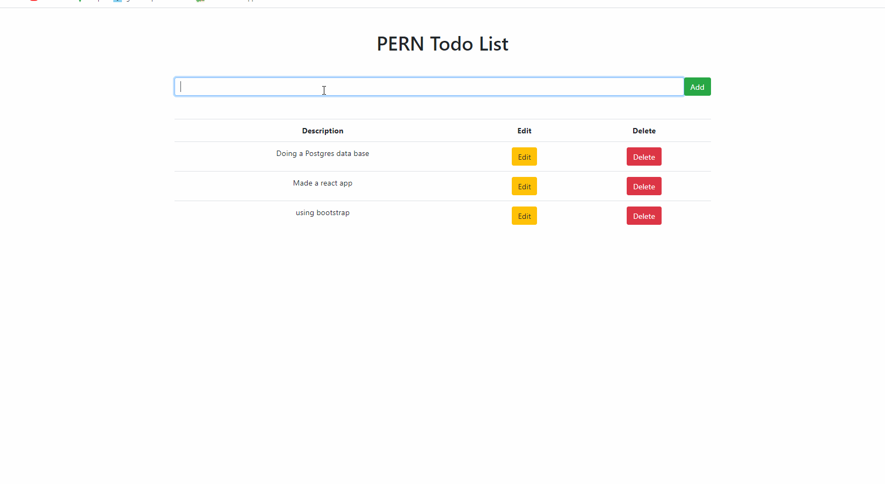

# Full stack Todo List

This a fullstack todo list using  and .

## Features

- Store a task in data base and display it on the app.

- Edit an existing task.

- Delete an existing task.

## Packages used

- 

- 

- 

- 

# Install

Go to the server project `cd server` and run `npm` in your console to install all dependencies and `npx nodemon index.js` to launch.
Go to the client project `cd client` run `yarn` in your console to install all dependencies and `yarn start` to launch.

